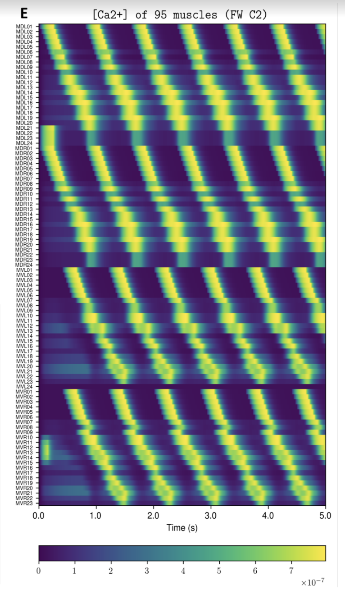
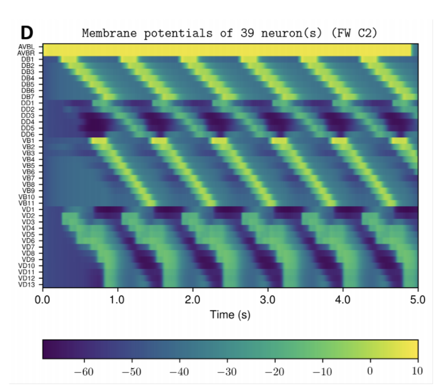

About **OpenWorm**
------------------

[OpenWorm](http://openworm.org) aims to build the first comprehensive computational model of *Caenorhabditis elegans* (*C. elegans*), a microscopic roundworm. With only a thousand cells, it solves basic problems such as feeding, mate-finding and predator avoidance. Despite being extremely well-studied in biology, a deep, principled understanding of the biology of this organism remains elusive.

We are using a bottom-up approach, aimed at observing the worm behaviour emerge from a simulation of data derived from scientific experiments carried out over the past decade. To do so we are incorporating the data available from the scientific community into software models. We are also forging new collaborations with universities and research institutes to collect data that fill in the gaps.

Quickstart
----------
We have put together a [docker container](http://docker.com) that pulls together the major components of our simulation and runs it on your machine.  When you get it all running it does the following:

1. Run our nervous system model, known as [c302](https://github.com/openworm/CElegansNeuroML/tree/master/CElegans/pythonScripts/c302), on your computer.  
2. Run our body model, known as [Sibernetic](https://github.com/openworm/sibernetic), on your computer, using the output of the nervous system model.
3. Produce graphs from the output of the nervous system model that demonstrate its output on your computer for you to inspect.
4. Produce a movie showing the output of the body model for you to inspect.

**Example Output**

**NOTE**: Running the simulation for the full amount of time would produce content like the above.  However, in order to run in a reasonable amount of time, the default run time for the simulation is limited.  As such, you will see only a partial output, equivalent to about 5% of run time, compared to the examples above.  To extend the run time, use the `-d` argument as described below.

**Installation**

Pre-requisites:

1. Currently Windows is not supported (see https://github.com/openworm/OpenWorm/issues/263); you will need Mac OS or Linux (or a virtual environment on Windows that runs either of those).
2. You should have at least 60 GB of free space on your machine and at least 2GB of RAM

To Install:

1. Install [Docker](http://docker.com) on your system.  
2. If your system does not have enough free space, you can use
an external hard disk.  The location for image storage
can be specified in the [Advanced Tab](https://forums.docker.com/t/change-docker-image-directory-for-mac/18891/15) in Preferences.

**Running**

1. Open a terminal and run: `git clone http://github.com/openworm/openworm`; `cd openworm`
1. Run `./run.sh`.
2. About 5-10 minutes of output will display on the screen as the steps run.
3. The simulation will end.  Exit the container with `exit` and run `stop.sh` on your system to clean up the running container.
4. Inspect the output in the `output` directory.

**Advanced**

***Arguments***

* -d [num] : Use to modify the duration of the simulation in milliseconds.  Default is 15.  Use 5000 to run for time to make the full movie above.

***Other things to try***

* Open a terminal and run `run-shell-only.sh`.  This will let you log into the system before it has run `master_openworm.py`.  From here you can inspect the internals of the various checked out code bases and installed systems and modify things. Afterwards you'll still need to run `stop.sh` to clean up.
* If you modify what gets installed, you should modify Dockerfile.  If you modify what runs, you should modify `master_openworm.py`.  Either way you will need to run `build.py` in order to rebuild the image locally.  Afterwards you can run normally.

### FAQ

#### **What is the docker container?**

The docker container is a self-contained environment in which you can run openworm simulations.  It's fully setup to get you started by following the steps above.  At the moment, it runs simulations and produces visualizations for you, but these visualizations must be viewed outside of the docker container.  

#### **Is it possible to modify the simulation without having to run `build.py`?**

Yes, but it is marginally more complex.  The easiest way is to modify anything in the docker container once you are inside of it - it will work just like a bash shell.  If you want to modify any code in the container, you'll need to use an editor that runs in the terminal, like nano.  Once you've modified something in the container, you don't need to re-build.  However, if you run `stop.sh` once you exit, those changes will be gone.

#### **How do I access more data than what is already output?**

The simulation by default outputs only a few figures and movies to your home system (that is, outside of the docker container).  If you want to access the entire output of the simulation, you will need to copy it from the docker container.  

For example, say you want to extract the worm motion data.  This is contained in the file `worm_motion_log.txt`, which is found in the `/home/ow/sibernetic/simulations/[SPECIFIC_TIMESTAMPED_DIRECTORY]/worm_motion_log.txt`.  The directory `[SPECIFIC_TIMESTAMPED_DIRECTORY]` will have a name like `C2_FW_2018_02-12_18-36-32`, and its name can be found by checking the `output` directory.  This is actually the main output directory for the simulation, and contains all output, including cell modelling and worm movement.  

Once the simulation ends and you exit the container with `exit`, but before you run `stop.sh`, run the following command from the openworm-docker-master folder:

`docker cp openworm:/home/ow/sibernetic/simulations/[SPECIFIC_TIMESTAMPED_DIRECTORY]/worm_motion_log.txt ./worm_motion_log.txt`

This will copy the file from the docker container, whose default name is `openworm`.  **It is crucial that you do not run `stop.sh` before trying to get your data out (see below)**

#### **What is the difference between `exit` and `stop.sh`?**

When you are in the Docker Container `openworm`, and are done interacting with it, you type `exit` to return to your system's shell.  This stops execution of anything in the container, and that container's status is now `Exited`.  If you try to re-start the process using `run-shell-only.sh`, you will get an error saying that the container already exists.  You can choose, at this point, to run `stop.sh`.  Doing so will remove the container and any files associated with it, allowing you to run a new simulation.  However, if you don't want to remove that container, you will instead want to re-enter it.

#### **How do I enter a container I just exited?**

If you run `stop.sh` you'll delete your data and reset the container for a new run.  If, however, you don't want to do that, you can re-enter the docker container like this:

    sudo docker exec -it openworm bash

You'll need to enter your su password.  This tells docker to all you to *execute* commands (`exec`) with an *interactive, tty* (`-it`)  bash (`bash`) shell in the container `openworm`.

You'll be able to interact with the container as before.

Documentation
-------------
Find out more about OpenWorm.  Documentation is available at [http://docs.openworm.org](http://docs.openworm.org).  [Join us on Slack](http://bit.ly/OpenWormVolunteer).

This repository references:
* A project-wide [Kanban board of all issues](https://waffle.io/openworm/openworm)
* Project-wide tracking via high-level [issues](https://github.com/openworm/OpenWorm/issues?labels=&milestone=&page=1&state=open) and [milestones](https://github.com/openworm/OpenWorm/milestones)
